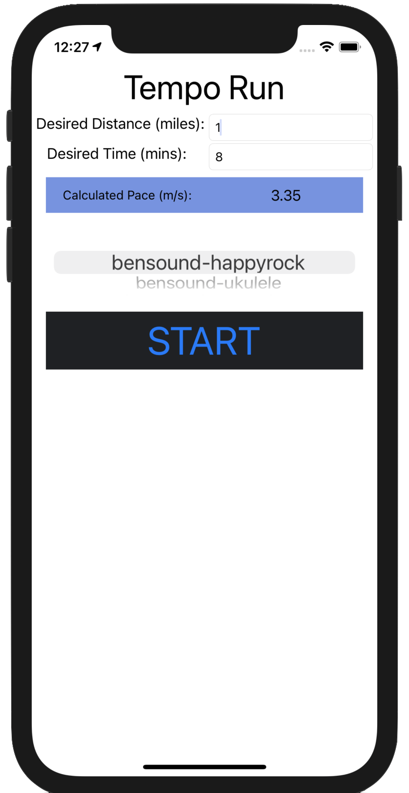

# Tempo-Run

## About

Tempo Run is an app developed in Swift which allows users to play music at different rates based off of the speed that they are travelling at. It's intended use is for live pacing during distance running.

## How to Use

To use TempoRun, you will need a device running Xcode 10 or higher. You can then clone this repository and run it through Xcode using either a simulated or real iOS device.

While running the app you can select a desired pace desired distance and time through the app's user interface. You can then start the song by pressing the "start" button.

  

It is important to note that, as intended, the music will not play in the app if you are stationary. If you are simulating an iOS device through Xcode you can get around this by selecting Debug > Location > City Run. If you are using a real iOS you can test it by running or walking yourself!

## Music Usage

All demo music on this app is from https://www.bensound.com.
